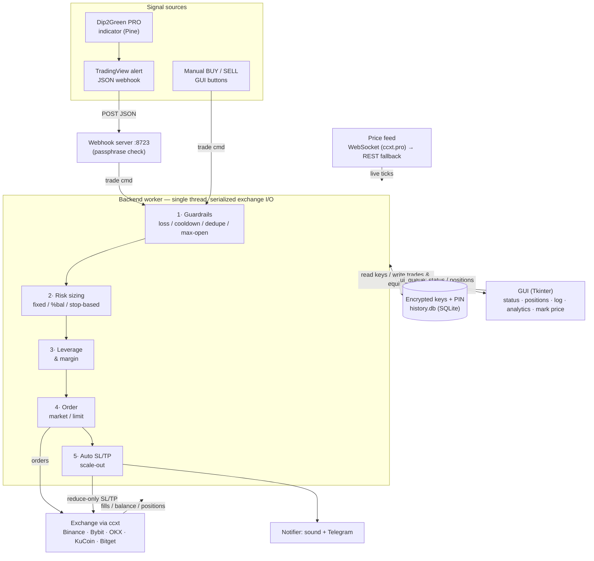
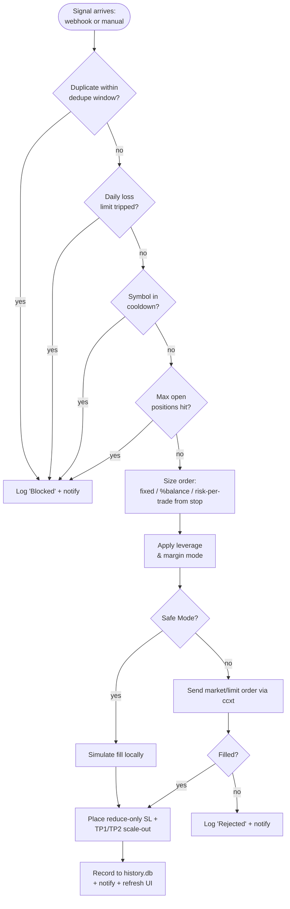
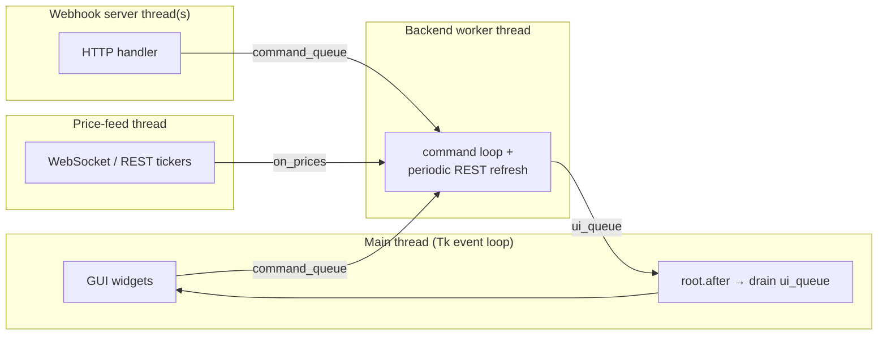
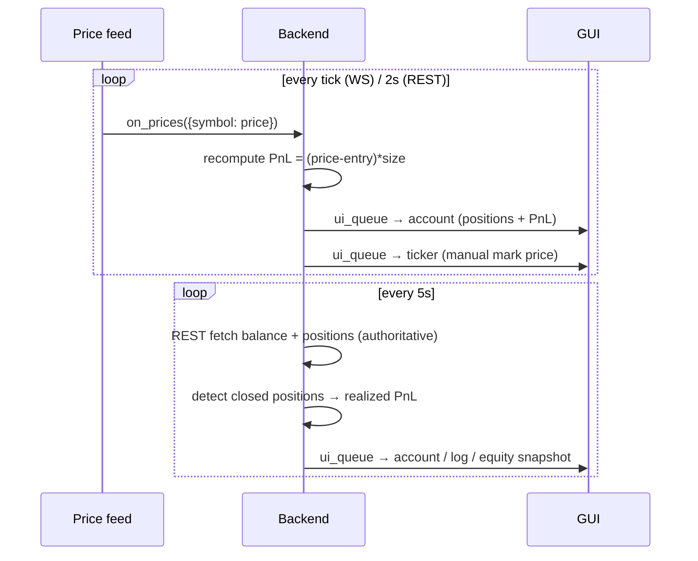

# How the Trading Bot Works

A visual reference. The PNG (`architecture.png`, rendered by `make_diagram.py`)
shows the whole system at a glance; the Mermaid diagrams below render directly
on GitHub and zoom into each flow.

---

## 1. System overview / data flow

---

## 2. Trade decision lifecycle (every entry)

---

## 3. Threading model (why the UI never freezes)

All exchange calls happen **only** on the worker thread, so the ccxt client is
never touched concurrently. Other threads communicate via thread-safe queues;
the GUI applies updates on the main thread from `ui_queue`.

---

## 4. Real-time price + PnL loop

---

To regenerate the PNG: `python make_diagram.py` (needs `matplotlib`).
