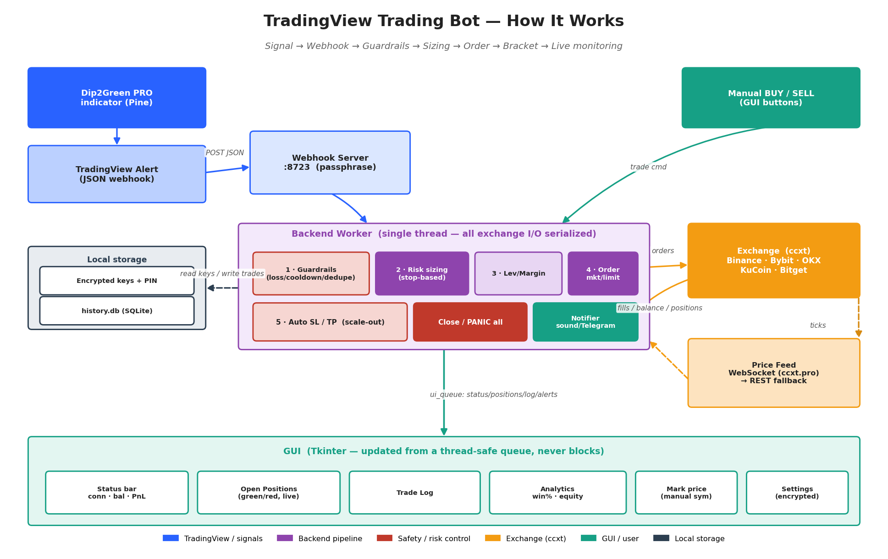
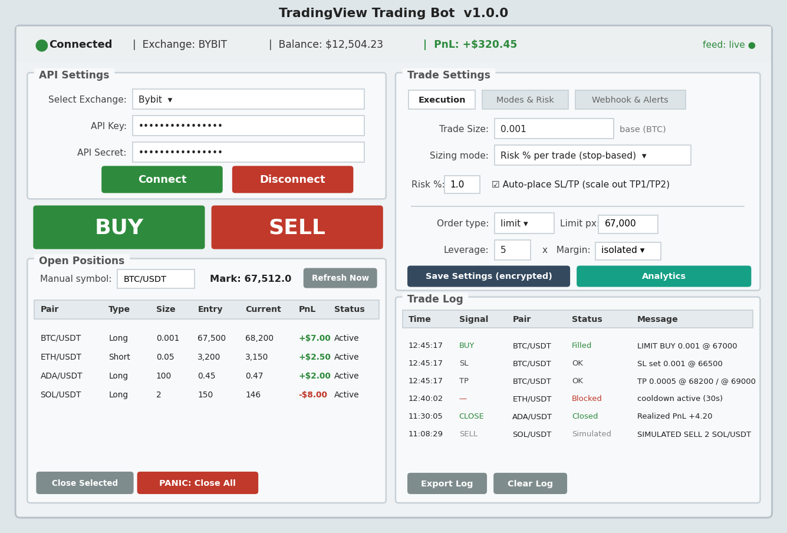
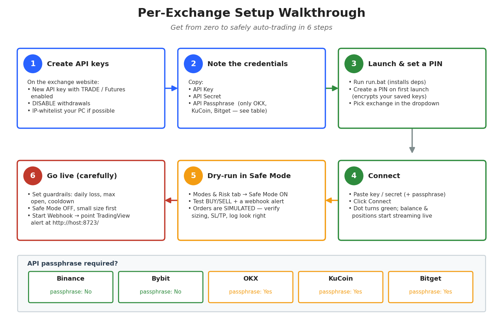

# Prometheus AI Crypto Bot (Windows)

A standalone Python desktop app that connects to a crypto exchange and executes
trades **manually** (BUY/SELL buttons) or **automatically** from **TradingView
webhook alerts** — driven by the `Prometheus_AI_Crypto_Bot.pine` indicator in
this repo (also compatible with Gold Scalpers / Dip2Green payloads).

Built with **Tkinter** (ships with Python, runs on every Windows version) plus
[`ccxt`](https://github.com/ccxt/ccxt) for exchange connectivity and
`cryptography` for encrypted, PIN-protected key storage.

> **How it works (diagrams):** see [`ARCHITECTURE.md`](ARCHITECTURE.md) for the
> data-flow, trade-lifecycle, and threading diagrams. Overview image:



### GUI layout



### Setup walkthrough



_(Regenerate any image with `python make_diagram.py` / `make_mockup.py` /
`make_setup_guide.py` — needs `matplotlib`.)_

---

## Features

| Area | What it does |
|------|--------------|
| **Status bar** | Live connection state (green/red), selected exchange, account balance, aggregate PnL |
| **Exchange panel** | Drop-down for **Binance, Bybit, OKX, KuCoin, Bitget**; API key/secret (+ passphrase for OKX/KuCoin/Bitget); Connect/Disconnect |
| **Lot control** | Fixed lot size **or** risk-based sizing (% of balance) |
| **Manual trading** | Big **BUY** / **SELL** buttons with a confirmation popup |
| **Account info** | Balance, PnL, and an Open Positions table (pair, side, size, entry, current, PnL, status) |
| **Trade log** | Timestamped, scrollable log of every signal/execution; **Export** to CSV and **Clear** |
| **Webhook** | Built-in HTTP receiver for TradingView alerts (auto-execution) |
| **Built-in strategy** | Runs the bot's own port of the Prometheus indicator on exchange candles — auto-trades with **no TradingView account** (Strategy tab) |
| **Real-time data** | WebSocket price feed (ccxt.pro) with REST fallback; live PnL recompute, green/red coloring, **Refresh Now**, and connection-drop alerts |
| **Auto SL/TP** | Reduce-only stop-loss + take-profit from the alert payload, with scale-out at TP1/TP2 |
| **Risk sizing** | Fixed lot, risk-% of balance, or **risk-% per trade from the entry→stop distance** |
| **Order types** | Market or **limit** orders, plus **leverage** and **margin-mode** (cross/isolated) control |
| **Guardrails** | Daily loss + daily profit limit (auto-halt), max open positions, per-symbol cooldown, duplicate-alert dedupe |
| **Position control** | Close Selected, and a red **PANIC: Close All** to flatten everything |
| **Analytics** | SQLite trade history, win rate / realized PnL / best-worst, and an equity curve |
| **Notifications** | Sound on fills/signals + optional **Telegram** alerts |
| **Security** | Fernet-encrypted API keys, PIN/password gate, optional **Read-only** monitoring mode, and **Safe Mode** (simulate, no real orders) |

---

## Install & run

1. Install **Python 3.8+** from python.org (tick *"Add Python to PATH"*).
2. Double-click **`run.bat`** — it installs dependencies on first run and launches the app.

Or from a terminal:

```bat
cd trading_bot
pip install -r requirements.txt
python main.py
```

### Windows compatibility

The built `PrometheusAICryptoBot.exe` runs on **Windows 10 / 11 and Server 2016+ (64-bit)**
with **no Python required** on the machine. Windows 7/8 are **not** supported by
the current Python + `cryptography` stack — building for those needs a pinned
legacy toolchain (Python 3.8 + older libs); ask if you specifically need it.

### Build a standalone `PrometheusAICryptoBot.exe`

To get a single double-clickable executable (no Python needed to *run* it),
build it **on a Windows PC** (a Windows `.exe` can only be built on Windows):

1. Install Python 3.8+ (tick *Add to PATH*).
2. Double-click **`build_exe.bat`** (or run `pyinstaller --noconfirm trading_bot.spec`).
3. The result is **`dist\PrometheusAICryptoBot.exe`** — copy it anywhere and run it.

> The repo ships **source + a build kit**, not a prebuilt binary — never run a
> trading `.exe` you didn't build yourself or can't inspect. Building from this
> source means you can read exactly what it does first.

### Or let GitHub build the exe for you (no local setup)

A GitHub Actions workflow (`.github/workflows/build-windows.yml`) builds the exe
on a Windows runner automatically:

- **Every push** to this branch → go to the repo's **Actions** tab → open the
  latest *Build Windows EXE* run → download the **`PrometheusAICryptoBot-windows`**
  artifact (a zip containing `PrometheusAICryptoBot.exe`).
- **Tag a release** (`git tag v1.0.0 && git push --tags`) → the exe is attached
  to the GitHub **Release** as a direct download.

The app icon is generated by `make_icon.py` (`icon.ico`, wired into the spec).

On first launch you'll be asked to **create a PIN**. It encrypts your saved
settings; there is no recovery if you forget it (by design).

> Without `ccxt` installed the app still launches in **simulation mode** so you
> can explore the UI; install requirements for real connectivity.

---

## "Windows protected your PC" (SmartScreen)

This warning appears for any **new, unsigned** app — it's not a virus detection.

- **To run it now:** click **More info → Run anyway** (one-time, per machine).
- The exe embeds **publisher/product metadata** and uses **no UPX packing**,
  which minimises antivirus false positives — but SmartScreen only fully
  disappears once the exe is **code-signed**.
- **Auto-signing is wired in:** add two repo secrets and every CI build is
  signed automatically (no code change needed):
  - `WIN_CERT_BASE64` — your code-signing `.pfx` certificate, base64-encoded.
  - `WIN_CERT_PASSWORD` — the `.pfx` password.
  Use an **EV code-signing certificate** for *instant* SmartScreen trust; a
  standard OV cert removes "unknown publisher" but still builds reputation over
  time.

---

## Connecting an exchange

1. Create **API keys** on your exchange. Enable *trading* but **disable
   withdrawals**, and IP-whitelist your machine where possible.
2. Pick the exchange, paste key/secret (+ passphrase for OKX/KuCoin/Bitget).
3. Click **Connect**. The dot turns green and balance/positions start updating.

**Safe Mode** (Trade Settings) simulates fills instead of sending real orders —
keep it on until you've verified everything. **Read-only** blocks all orders
entirely (monitoring only).

---

## Auto-trading from TradingView (Prometheus indicator)

The flow:

```
Prometheus alert  →  TradingView webhook  →  this bot's receiver  →  exchange order
```

1. The **webhook auto-starts on launch** (port **8723**) — the Start/Stop button
   just toggles it. Optionally set a **Webhook passphrase** for extra auth.
2. Keep the **Strategy filter** at **`Prometheus`** (the default). The bot then
   acts **only** on alerts whose `comment`/strategy tag matches the indicator's
   **Strategy tag** (default `Prometheus`) and ignores everything else. Leave the
   filter blank to accept all alerts.
3. Expose port 8723 to TradingView (it only POSTs to public URLs):
   - run a tunnel (e.g. `ngrok http 8723`) and use the public URL, **or**
   - host on a VPS / forward the port on your router.
4. Add `Prometheus_AI_Crypto_Bot.pine` to a **crypto** chart, then create an alert:
   - Condition: *Any alert() function call*; set **Alert Format = "Webhook JSON"**.
   - Webhook URL: `http://YOUR_PUBLIC_HOST:8723/`
5. The indicator sends payloads like (Entry + TP1 + TP2, **no stop-loss**):

   ```json
   {"action":"buy","symbol":"BTCUSDT","passphrase":"","entry":67500,"tp1":68200,"tp2":69500,"comment":"Prometheus"}
   ```

   The bot reads `action` + `symbol`, auto-fills the Manual symbol box with the
   incoming pair, sizes the order from your **Sizing mode**, and places the entry
   plus **TP1/TP2** (50/50 scale-out). With no SL in the payload the bot places
   no protective stop — so use **Fixed lot** or **Risk % of balance** sizing
   (stop-based sizing needs a stop).

**Lifecycle events.** The indicator also emits post-entry events
(`{"event":"tp1_hit",...}`, `tp2_hit`) tagged with the same `comment`, so the
strategy filter passes them through. They're logged + notified, and with
**"Move stop to breakeven on TP1"** enabled (Modes & Risk tab) a `tp1_hit` event
places a breakeven stop at entry. TP exits themselves are handled by the bot's
own reduce-only TP orders on the exchange, so events never double-fire.

> Earlier indicators (Gold Scalpers, Dip2Green) also work — just set the
> **Strategy filter** to match their `comment` tag, or leave it blank.

> **Note:** TradingView webhooks require a **paid** TradingView plan.

---

## Built-in strategy (no TradingView needed)

The **Strategy** tab runs the bot's own port of the `Prometheus_AI_Crypto_Bot.pine`
indicator directly on exchange candles — so it can auto-trade **without a
TradingView account, webhook, or relay**. It's the *same* dip → green-sequence
logic (`strategy.py`), re-implemented in Python and verified against unit-test
fixtures.

```
Exchange candles  →  strategy.py (Pine port)  →  this bot's pipeline  →  exchange order
```

1. Connect to your exchange as usual.
2. Open the **Strategy** tab, tick **Enable built-in strategy**, set the
   **Symbols** (comma-separated, e.g. `BTC/USDT, ETH/USDT`) and **Timeframe**.
   *(Requires a valid **licence token** — the same one used for cloud signals,
   entered under Webhook → Cloud signals. See below.)*
3. Tune the dip/green/SL/TP parameters (they mirror the indicator's inputs) — or
   leave the **Auto** preset, which picks BTC/ETH/crypto thresholds by symbol.
4. The runner polls for freshly-**closed** candles, evaluates the strategy, and
   on a confirmed BUY places the entry + TP1/TP2 (+ SL) through the same
   guardrail → sizing → bracket pipeline as a webhook signal.

**See it on a chart.** The **📈 Chart** button (Strategy tab) opens a candlestick
window that overlays the strategy's **own** signals — yellow dip diamonds, lime
BUY arrows, and ENTRY / TP1 / TP2 / SL lines — exactly as the Pine indicator
draws them, computed by the same engine on the same exchange candles. It also
marks **outcomes** — where price later hit TP1/TP2 (dots) or SL (✗), plus a
W/L/P status tag on each BUY — and overlays a price **moving average**. Below
the price pane it adds a **volume** sub-pane (with the volume-average line the
dip filter uses) and an **RSI** panel (oversold zone shaded, the strategy's
threshold marked). Hover for an OHLC + volume + RSI crosshair, scroll to zoom,
drag to pan; it auto-refreshes as candles close. By default it **follows the
Strategy tab** — symbol, timeframe, params and the exchange/market it trades on
update live, so the chart always mirrors what the strategy actually does; untick
*Follow Strategy tab* to browse another symbol without affecting trading. It's a
pure-Tkinter Canvas (no charting dependency), so the build stays light.

**How it stays honest:**
- **Non-repaint** — only *closed* candles are evaluated (the live forming candle
  is dropped), matching the indicator's "Bar Close" alert mode.
- **No double-firing** — each closed candle is evaluated once; on startup the
  current candle is *primed* (not traded), so the bot never chases a signal that
  closed before it launched.
- **Crash-safe** — the engine is stateless and replays from candle history every
  poll, so a restart mid-setup loses nothing.
- **Parity** — the logic is identical to the chart; the only possible difference
  is the candle *data* (exchange OHLCV vs TradingView aggregation), which is why
  the runner pulls candles from the same exchange you trade on.

**Licence gate.** The built-in engine is gated by the **same licence token** as
the cloud feed. On startup (and every few hours) the app validates the token
against the relay's `verify.php`; a missing, revoked, or expired token disables
the engine (the Strategy tab shows *blocked — licence invalid/expired*). A
transient relay outage is tolerated for a grace window so a paying user isn't
stranded mid-session. Enter the token under **Webhook → Cloud signals**.

> The built-in strategy and the TradingView webhook/relay can run **side by
> side** — they all feed the same trade pipeline. Use whichever you prefer, or
> both. The runner only trades while **enabled, connected, and licensed**.

---

## Manual webhook test

With the webhook running you can fire a test signal locally:

```bat
curl -X POST http://127.0.0.1:8723/ -H "Content-Type: application/json" ^
  -d "{\"action\":\"buy\",\"symbol\":\"BTC/USDT\",\"entry\":67500,\"tp1\":68200,\"tp2\":69500,\"comment\":\"Prometheus\"}"
```

In **Safe Mode** you should see a `BUY` (Simulated) row plus two `TP` rows in the
Trade Log, and the Manual symbol box auto-fill to `BTC/USDT`. If you instead see
*"ignored (strategy … != Prometheus)"*, your **Strategy filter** doesn't match.

---

## Real-time data workflow

Once connected, the bot keeps the account view live:

- **Positions (authoritative):** a background thread polls the exchange via
  ccxt every few seconds — `fetch_positions` (Binance Futures `positionRisk`,
  Bybit `/v5/position/list`, OKX `/account/positions`, etc.) for symbol, side,
  size, entry, current and unrealized PnL.
- **Prices (real-time):** `pricefeed.py` streams tickers for your open symbols
  over **WebSocket** (`ccxt.pro`, `watch_tickers`) when available, falling back
  to a fast **REST `fetch_tickers` poll** otherwise. Only held symbols are
  subscribed, so it stays within rate limits.
  > **Note:** the **prebuilt exe is size-optimised** and ships *without* the
  > ccxt WebSocket/async layer, so it uses the **REST poll (~2s)** path. Run
  > from source with full `ccxt` installed to get live WebSocket ticks.
- **PnL** is recomputed locally on every tick — `(current − entry) × size`
  (reversed for shorts) — so the table and status bar move instantly without
  waiting for the next REST poll. Profit rows are green, losses red.
- **Manual symbol mark price:** the symbol in the manual-trade box is streamed
  too — its live **Mark** price shows next to it even when you hold no position
  in it, so you can see the price before clicking BUY/SELL. The feed subscribes
  to the union of held symbols and the manual symbol.
- **Trade log sync:** when a position disappears between refreshes it is logged
  as **Closed**.
- **Resilience:** keys are encrypted at rest; ticker requests use a keyless
  public client; repeated REST failures (dropped link / rate-limit storm)
  raise a one-time **connection alert** and amber status, auto-clearing when the
  feed recovers. A **Refresh Now** button forces an immediate update.

All exchange I/O runs off the UI thread (single worker thread + a price-feed
thread), and the GUI is updated from a thread-safe queue, so the window never
freezes.

> Real-time prices are only fetched in **live** connections. In **Safe Mode**
> the feed is skipped and fills/positions are simulated locally.

## Auto SL/TP + risk-based sizing

The Dip2Green alert payload carries `entry`, `sl`, `tp1`, `tp2`, `rr`. The bot
uses them:

- **Sizing mode** (Trade Settings):
  - *Fixed lot* — use the lot size as entered.
  - *Risk % of balance* — spend `risk%` of balance at the current price.
  - *Risk % per trade (stop-based)* — size so that being stopped out at `sl`
    loses exactly `risk%` of balance: `amount = (balance × risk%) ÷ |entry − sl|`.
    This is the recommended model and the reason the indicator sends the stop.
- **Auto-place SL/TP** — after the entry fills, the bot places a **reduce-only
  stop-loss** at `sl` and **reduce-only take-profits**. With both TP1 and TP2 it
  **scales out** (default 50% at TP1, the rest at TP2). Uses ccxt's unified
  `stopLossPrice` / `takeProfitPrice` trigger params.

Any missing field falls back safely (e.g. stop-based sizing reverts to the fixed
lot if no stop is provided), so a trade is never sized to zero by accident.

## Order types, leverage & guardrails

Settings are organised into three tabs (Execution / Modes & Risk / Webhook & Alerts).

**Execution tab:**
- **Order type** — *market* or *limit*. For a limit order the price comes from
  the Limit-px field (manual) or the alert's `entry` (webhook); falls back to the
  current mark if neither is given.
- **Leverage** (`0` = leave exchange setting) and **Margin mode**
  (default / cross / isolated) are applied best-effort to the traded symbol
  before each order. Spot markets / unsupported exchanges simply ignore them.

**Modes & Risk tab — guardrails** (each `0` = disabled), checked on every new
entry (closing is never blocked):
- **Max open positions** — refuse to open a *new* symbol once the cap is hit.
- **Daily loss limit** — once the day's realized PnL reaches `−limit` the bot
  **halts new entries** and raises an alert; resets at midnight or via the
  **Reset daily limit** button.
- **Cooldown / symbol** — minimum seconds between trades on the same symbol.
- **Dedupe window** — drop an identical (symbol, side) signal that repeats
  within the window (protects against a webhook firing twice).

## Analytics & notifications

- **Analytics** button opens a window with total/filled/rejected/closed counts,
  **win rate**, **realized PnL** (estimated from each position's last mark at
  close), best/worst trade, and an **equity curve** drawn from periodic balance
  snapshots. All persisted in `history.db` (SQLite).
- **Notifications**: a sound plays on fills/signals (Windows `winsound`).
  Enter a **Telegram bot token + chat id** to also receive a message on every
  entry, close, and connection alert. Leave them blank to disable.

## Security notes

- Keys are stored **encrypted** (Fernet/AES) under a key derived from your PIN
  (PBKDF2-HMAC-SHA256, per-install salt). The PIN is never written to disk.
- Local secret/log files are git-ignored.
- This software places **real trades with real money** when Safe Mode is off.
  Start in Safe Mode, use small sizes, and never risk funds you can't lose.
  Provided as-is, no warranty.

---

## File map

| File | Role |
|------|------|
| `main.py` | Entry point: login → GUI |
| `login.py` | PIN create/verify dialog |
| `gui.py` | Tkinter frontend (the mockup layout) |
| `backend.py` | Single worker thread; serializes all exchange I/O |
| `exchange.py` | ccxt wrapper; market/limit orders, SL/TP, leverage/margin; pure `recompute_pnl`/`size_order`/`plan_take_profits` |
| `guardrails.py` | Pure entry-gate logic (daily loss, max open, cooldown, dedupe) |
| `pricefeed.py` | Real-time price feed (WebSocket + REST fallback) |
| `history.py` | SQLite trade history + analytics stats |
| `notifications.py` | Sound + Telegram notifications |
| `analytics_window.py` | Analytics window (stats + equity curve) |
| `webhook_server.py` | TradingView alert receiver |
| `relay_client.py` | Cloud-relay poller (licence-token signals) |
| `strategy.py` | Pure port of the Prometheus indicator (dip→green engine) |
| `strategy_runner.py` | Built-in strategy thread: candles → `strategy.evaluate` → trade |
| `licence.py` | Licence verification (gates the built-in strategy via the relay) |
| `chart_window.py` | Candlestick chart (Canvas) with the strategy's dip/BUY/TP/SL overlays |
| `security.py` | Encryption + PIN |
| `config.py` | Constants & storage paths |
| `run.bat` | Windows launcher |
